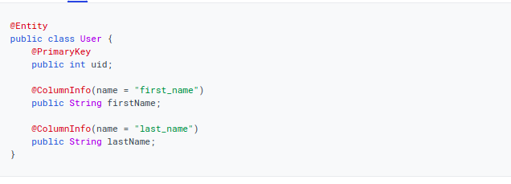
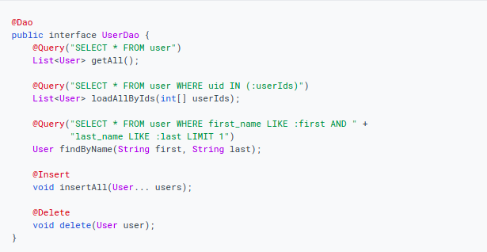
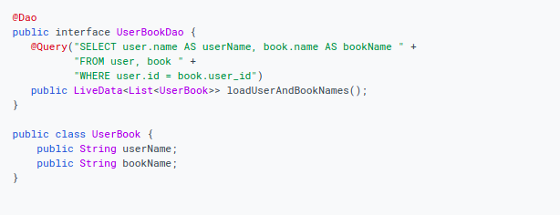

# Read: 29 - Room (save a local database using Room)

## Definition

---
Architecture component is a set of library work together to make the application more efficient. One of this library is Room.

The Room library is created to encapsulate the SQLite. The Room here is the resource of the data.

- Room DB contains SQLite and Data Access Object (DAO) which is interface to write all the operation like insert, update, delete.

## Steps for configurations

### Add the dependency

### create Entity class using Annotation

### Data access object (DAO)

### Database

### Usage

connect Db with Acitvity

or you can create an instance inside the database following the steps below:

1. Create a private constructor
2. Create a private static instance
3. Create a public static method which returns the instance that we create it.

## Define relationships between objects

---

There are two way in Room library to define the relation between the objects:

### First Way - Using intermediate data class with embedded objects

### Second Way - Using a relational query method with a multimap return type

**Multimap return types**

## Accessing data using Room DAOs

---
