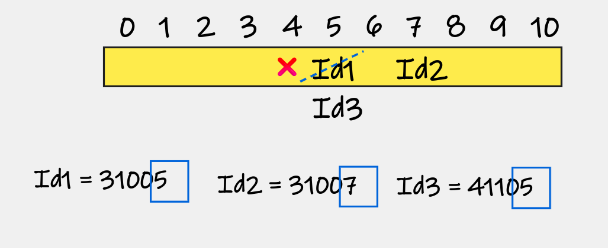
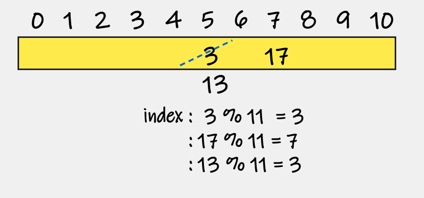
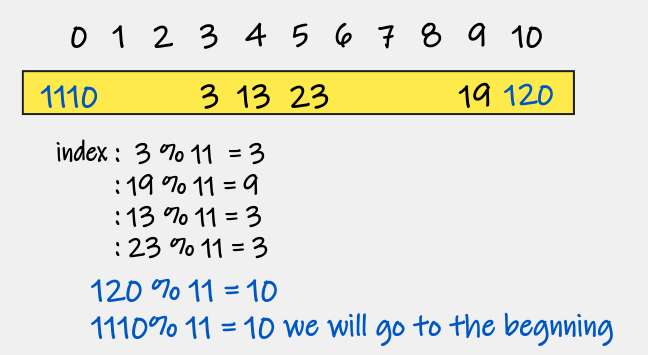
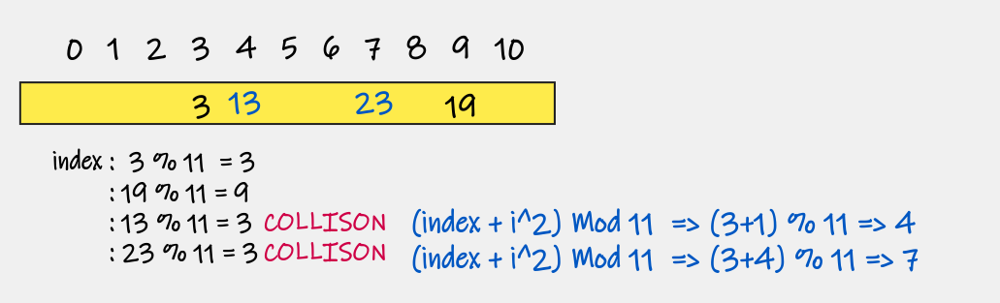

# Read 30 - HashTable

## Hashing

---
Hashing make the Search, insert, Delete, and Retrieve have O(1) time complexity

- The Principle of Hashing is adding the Element inside the array in the same index of the Element

## Collision Problem

---
When we save the data for (example id) we do not use all of the Id because t5hat is waste a lot of space as shown below, we will use the last digit in the Id but if the another Id has the same last digit the old Id will be removed then the algorithm will store the new id.

> There are three method to solve this problem:

1. `REPLACEMENT`
2. `OPEN ADDRESSING` which represented by Linear and Quadratic Probing

3. `OPEN HASHING` which solving using `CHAINING`

**REPLACEMENT:**

- To save data inside fixed size array using hash function which use `MOD`

> index: h(Key) = Key % Size `or` using this equation: n1-(n1/n2) * n2

- **OPEN ADDRESSING**

- `1. Linear probing` similar to Replacement but instead remove the old element we wil save the data inside the element next to the old element

- If the element next the old element has already element we use the next to the last element

- If the hashTable size reach to the last Element we use the circular method to go back to the beginning of hashTable.

The time complexity time in search and add not O(1) so, we can link the element using `Quadrtic Probing`

`2. QUADRATIC`

- That mean when we have `COLLSION` we change the equation of index to

> (index + i2) `MOD` Size

where i represent the number of repeat the result of index

**CHAINING:**

- Which mean each element inside the hashTable called Bucket

- `Bucket:` is what is contained in each index of the array of the hashTable. Each index is a bucket. An index could potentially contain multiple key/value pairs if a collision occurs.

- Each bucket has a set of entries which are the elements we want to add it inside the hashTable

- The worst case of this scenario when all of the element has the same index.