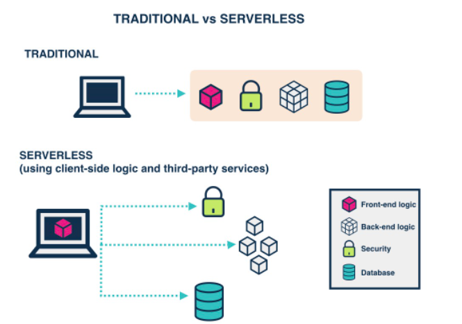
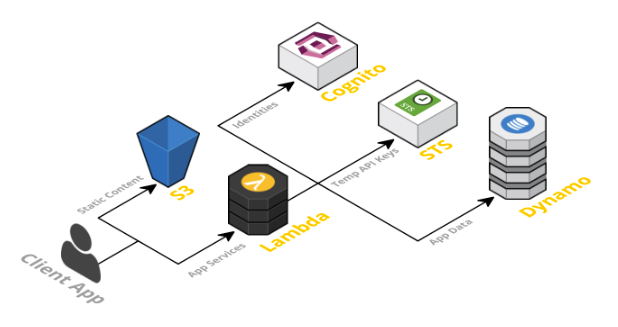
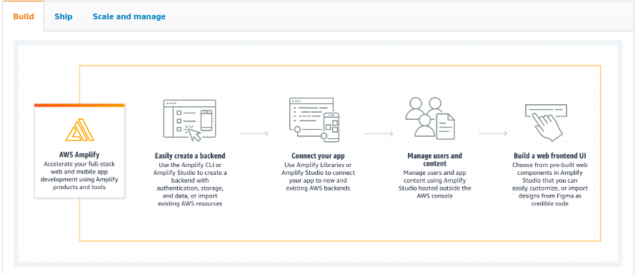

# What is Serverless Architecture? What are its Pros and Cons?

## Definition

---
Serverless is a cloud computing execution model where the cloud provider dynamically manages the allocation and provisioning of servers.

Serverless is not just about the hype, it promises the possibility of ideal business implementations which sounds quite pleasant to the ears and probably light on the budget as well.

Expectations apart, Serverless is really breaking ground in its path to disrupt your server infrastructure.

Serverless is already used in production by companies like Netflix, Reuters, AOL, and Telenor.

Serverless is all set to take up its own place, but don't expect Serverless to conquer your infrastructure completely.

There will be use cases where serverless might prove to be the wrong choice.

A serverless application runs in stateless compute containers that are event-triggered, ephemeral, and fully managed by the cloud provider.

Serverless applications are event-driven cloud-based systems where application development rely solely on a combination of third-party services, client-side logic and cloud-hosted remote procedure calls.

Most of the cloud providers have invested heavily in serverless and thats a lot of money; with the given massive promotion and realistic offering you can safely assume serverless to be one of the most used cloud services in upcoming years.

## Traditional vs. Serverless Architecture

---
Traditional vs. Serverless Architecture For years your applications have run on servers which you had to patch, update, and continuously look after late nights and early mornings due to all the unimaginable errors that broke your production.

Serverless tends to be unlike the aforementioned, you no longer need to worry about the underlying servers.

Regardless the cool features of Serverless in some cases, the traditional architecture outshines it.

## Pricing

---
One of the major advantages of using Serverless is reduced cost, for years the cost of provisioning servers and maintaining that 24x7 server team which blew a hole in your pocket is gone.

The cost model of Serverless is execution-based: you're charged for the number of executions.

## Networking

---
The downside is that Serverless functions are accessed only as private APIs.

For simple applications with few dependencies, Serverless is the winner; for anything more complex, Traditional Architecture is the winner.

## Environments

---
Setting up different environments for Serverless is as easy as setting up a single environment.

TimeoutWith Serverless computing, there's a hard 300-second timeout limit.

Too complex or long-running functions aren't good for Serverless, but having a hard timeout makes it impossible to perform certain tasks.

A hard limit on this time makes Serverless unusable for applications that have variable execution times, and for certain services which require information from an external source.

## Scale

---
Scaling process for Serverless is automatic and seamless, but there is a lack of control or entire absence of control.

While automatic scaling is great, it's difficult not to be able to address and mitigate errors related to new Serverless instances.

It's a tie between Serverless and Traditional Architecture.

## Functions as a Service - FaaS

---
FaaS is an implementation of Serverless architectures where engineers can deploy an individual function or a piece of business logic.

**Key properties of FaaS:** Independent, server-side, logical functionsFaaS are similar to the functions you're used to writing in programming languages, small, separate, units of logic that take input arguments, operate on the input and return the result.

**Stateless**
With Serverless, everything is stateless, you can't save a file to disk on one execution of your function and expect it to be there at the next.

**Event-triggered**
Although functions can be invoked directly, yet they are usually triggered by events from other cloud services such as HTTP requests, new database entries or inbound message notifications.

**The Serverless App**
A Serverless solution consists of a web server, Lambda functions, security token service, user authentication and database.

All of the static HTML, CSS and JS files for our application can be served from S3.Lambda functions - They are the key enablers in Serverless architecture.

The application services for logging in and accessing data will be built as Lambda functions.

These functions will read and write from your database and provide JSON responses.

DynamoDB is not essential for a serverless application but is used as an example here.

## Benefits of Serverless Architecture

---
From business perspective:

1. The cost incurred by a serverless application is based on the number of function executions, measured in milliseconds instead of hours.
2. Process agility: Smaller deployable units result in faster delivery of features to the market, increasing the ability to adapt to change.
3. Cost of hiring backend infrastructure engineers goes down.
4. Reduced operational costs

**From developer perspective:**

1. Reduced liability, no backend infrastructure to be responsible for.
2. Zero system administration.
3. Easier operational management.
4. Fosters adoption of Nanoservices, Microservices, SOA Principles.
5. Faster set up.
6. Scalable, no need to worry about the number of concurrent requests.
7. Monitoring out of the box.
8. Fosters innovation.

**From user perspective:**

1. If businesses are using that competitive edge to ship features faster, then customers are receiving new features quicker than before.
2. It is possible that users can more easily provide their own storage backend(i.e Dropbox, Google Drive).
3. It’s more likely that these kinds of apps may offer client-side caching, which provides a better offline experience.

## Drawbacks of Serverless Architecture

---

**From business perspective:**

1. Reduced overall control.
2. Vendor lock-in requires more trust for a third-party provider.
3. Additional exposure to risk requires more trust for a third party provider.
4. Security risk.
5. Disaster recovery risk
6. Cost is unpredictable because the number of executions is not predefined
7. All of these drawbacks can be mitigated with open-source alternatives but at the expense of cost benefits mentioned previously

**From developer perspective:**

1. Immature technology results in component fragmentation, unclear best-practices.
2. Architectural complexity.
3. The discipline required against function sprawl.
4. Multi-tenancy means it’s technically possible that neighbour functions could hog the system resources behind the scenes.
5. Testing locally becomes tricky.
6. Significant restrictions on the local state.
7. Execution duration is capped.
8. Lack of operational tools

**From user perspective:**

1. Unless architected correctly, an app could provide a poor user experience as a result of increased request latency.

## Serverless Frameworks

---
Serverless platforms need infrastructures where they can be executed, provider agnostic frameworks provide a platform agnostic way to define and deploy Serverless code on various cloud platforms or commercial services.

In the same way, Serverless can shine when used in proper place.

Take a look at the awesomeness that is Serverless, its time to take a peek at what Serverless looks from the inside.

Here are few links to get you started on your Serverless journey.

I hope this article helped in the understanding of Serverless Computing.

I'd love to hear about how you use Serverless in your projects.

## AWS Amplify

AWS Amplify is a set of purpose-built tools and features that lets frontend web and mobile developers quickly and easily build full-stack applications on AWS, with the flexibility to leverage the breadth of AWS services as your use cases evolve.

**How It Works**
With Amplify, you can configure a web or mobile app backend, connect your app in minutes, visually build a web frontend UI, and easily manage app content outside the AWS console. Ship faster and scale effortlessly—with no cloud expertise needed.

## Resources

---

[Resource 1](https://hackernoon.com/what-is-serverless-architecture-what-are-its-pros-and-cons-cc4b804022e9)
[Resource 2](https://aws.amazon.com/amplify/)
[Resource 3](https://docs.amplify.aws/cli/graphql/data-modeling/)
