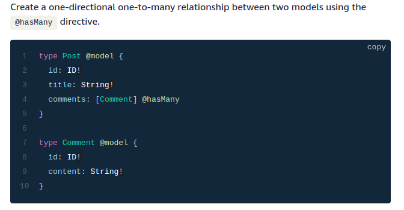
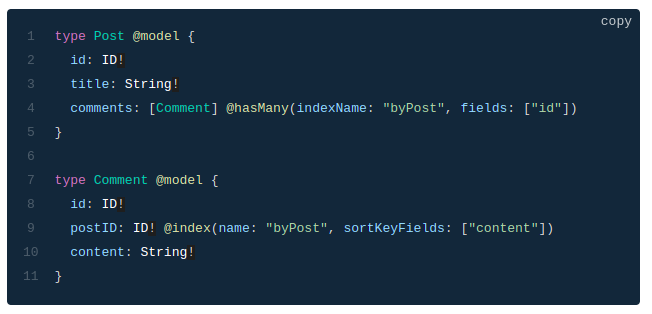
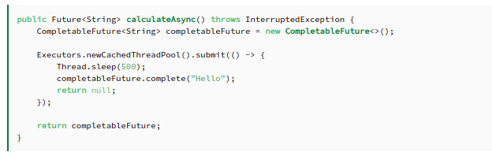
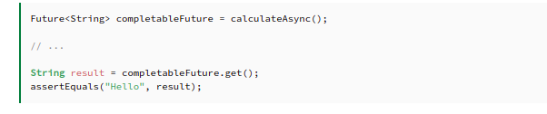
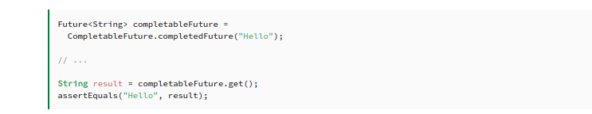

# Read 33 - GraphQL @connection

## Definition

---
Is a query language that handle with our API. The GraphQL Transform provides a simple to use abstraction that helps you quickly create backends for your web and mobile applications on AWS.

## Relationship Between Objects

---
There are the patterns available between connected objects:

one-to-one,
one-to-many
many-to-one
For a many-to-many relationship, you can use two one-to-many relationships

## Has Many relationship

---

> To Create One-To-Many Relationship using hasMany

This generates queries and mutations that allow you to retrieve the related Comment records from the source Post record

You can customize the specific secondary index used for the "Has many" relationship.

Pass in the secondary index name indexName parameter and the respective fields which match the connected index.

## Using CompletableFuture as a Simple Future

---
First of all, the CompletableFuture class implements the Future interface, so we can use it as a Future implementation, but with additional completion logic.

For example, we can create an instance of this class with a no-arg constructor to represent some future result, hand it out to the consumers, and complete it at some time in the future using the complete method.

the method completes the Future by providing the result to the complete method:

Also observe that the get method throws some checked exceptions, namely ExecutionException (encapsulating an exception that occurred during a computation) and InterruptedException (an exception signifying that a thread executing a method was interrupted):

If we already know the result of a computation, we can use the static completedFuture method with an argument that represents a result of this computation. Consequently, the get method of the Future will never block, immediately returning this result instead:

 