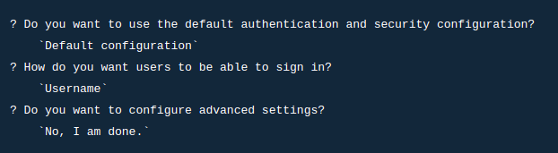
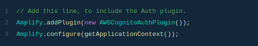
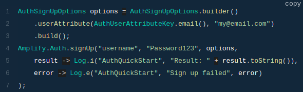

# Read: 36 - Cognito

## Introduction 

---
The Amplify Auth category provides an interface for authenticating a user. Behind the scenes, it provides the necessary authorization to the other Amplify categories.


## Configure Auth Category

---

The command below is used to start provisioning auth resources in the backend:

 > amplify add auth

And select the options:



## Install Amplify Libraries

---

Add the dependencies inside the build.gradle 

```
dependencies {
    implementation 'com.amplifyframework:aws-auth-cognito:1.35.4'
}
```

## Initialize Amplify Auth

---



## Check the current auth session

---

Test on the `Main Activity` in onCreate method

```
Amplify.Auth.fetchAuthSession(
    result -> Log.i("AmplifyQuickstart", result.toString()),
    error -> Log.e("AmplifyQuickstart", error.toString())
);
```

## Authentication - Sign in

---

The Auth category can be used to register a user, confirm attributes such as email and phone, and sign in with multi-factor authentication if desired. It's set up to handle users and their properties using Amazon Cognito User Pools.

### Register a user

any application requires a username, password and a valid email id as parameters to register a user. Invoke the following api to initiate a sign up flow.



then we need to configure tha sign up

    Amplify.Auth.confirmSignUp(
    "username",
    "the code you received via email",
    result -> Log.i("AuthQuickstart", result.isSignUpComplete() ? "Confirm signUp succeeded" : "Confirm sign up not complete"),
    error -> Log.e("AuthQuickstart", error.toString())
);

### Sign in a user

we need to call the Auth method as shown below:

    Amplify.Auth.signIn(
    "username",
    "password",
    result -> Log.i("AuthQuickstart", result.isSignInComplete() ? "Sign in succeeded" : "Sign in not complete"),
    error -> Log.e("AuthQuickstart", error.toString())
);

### multi-factor authentication

Some steps in setting up multi-factor authentication can only be chosen during the initial setup of Auth. If you have already added Auth via the CLI, navigate to your project directory in Terminal, run amplify auth remove and when that completes, amplify push to remove it.

Then, run amplify add auth and setup Auth

Finally, push the changes using:

> amplify push

**NOTE:**  
When you sign up, be sure to include both email and phone attributes with the phone number formatted

You'll then confirm signup, sign in, and get back a nextStep in the sign in result of type CONFIRM_SIGN_IN_WITH_SMS_MFA_CODE. A confirmation code will also be texted to the phone number provided above. Pass the code you received to the confirmSignIn api:

    Amplify.Auth.confirmSignIn(
    "confirmation code received via SMS",
    result -> Log.i("AuthQuickstart", result.toString()),
    error -> Log.e("AuthQuickstart", error.toString())
);