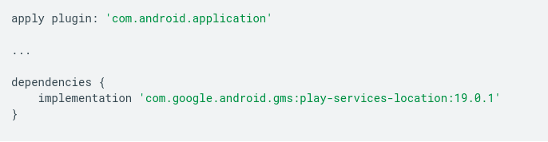

# Read39 - Get the last known location

Using the Google Play services location APIs, your app can request the last known location of the user's device. In most cases, you are interested in the user's current location, which is usually equivalent to the last known location of the device.

## Set up Google Play services

---
To access the fused location provider, your app's development project must include Google Play services.

## Specify app permissions

---

Types of location access
Each permission has a combination of the following characteristics:

`Category`: Either foreground location or background location.

`Accuracy`: Either precise location or approximate location.

**Foreground location**

If your app contains a feature that shares or receives location information only once, or for a defined amount of time, then that feature requires foreground location access.
Some examples include the following: Within a navigation app, a feature allows users to get turn-by-turn directions.
The system considers your app to be using foreground location if a feature of your app accesses the device's current location in one of the following situations: An activity that belongs to your app is visible.

Your app is running a foreground service.
When a foreground service is running, the system raises user awareness by showing a persistent notification.
Additionally, it's recommended that you declare a foreground service type of location, as shown in the following code snippet.

    <!-- Recommended for Android 9 (API level 28) and lower. -->
    <!-- Required for Android 10 (API level 29) and higher. -->
    <service
        android:name="MyNavigationService"
        android:foregroundServiceType="location" ... >
    <!-- Any inner elements would go here. -->
    </service>

**Background location**

    <manifest ... >
    <!-- Required only when requesting background location access on
       Android 10 (API level 29) and higher. -->
    <uses-permission android:name="android.permission.ACCESS_BACKGROUND_LOCATION" />
    </manifest>

### Request location access at runtime

When a feature in your app needs location access, wait until the user interacts with the feature before making the permission request

The app contains a "share location" feature that requires foreground location access. The app doesn't request the location permission, however, until the user selects the Share location button.

### User can grant only approximate location

When your app requests both ACCESS_FINE_LOCATION and ACCESS_COARSE_LOCATION, the system permissions dialog includes the following options for the user:

Precise: Allows your app to get precise location information.
Approximate: Allows your app to get only approximate location information.

### Request background location if necessary

Permission dialog contents depend on target SDK version

## Create location services client

---

    private FusedLocationProviderClient fusedLocationClient;

    // ..

    @Override
    protected void onCreate(Bundle savedInstanceState) {
    // ...

    fusedLocationClient = LocationServices.getFusedLocationProviderClient(this);
    }

## Get the last known location

---

    fusedLocationClient.getLastLocation()
        .addOnSuccessListener(this, new OnSuccessListener<Location>() {
            @Override
            public void onSuccess(Location location) {
                // Got last known location. In some rare situations this can be null.
                if (location != null) {
                    // Logic to handle location object
                }
            }
        });

## Choose the best location estimate

---

The FusedLocationProviderClient provides several methods to retrieve device location information. Choose from one of the following, depending on your app's use case:

getLastLocation() gets a location estimate more quickly and minimizes battery usage that can be attributed to your app. However, the location information might be out of date, if no other clients have actively used location recently.
getCurrentLocation() gets a fresher, more accurate location more consistently. However, this method can cause active location computation to occur on the device

This is the recommended way to get a fresh location, whenever possible, and is safer than alternatives like starting and managing location updates yourself using requestLocationUpdates(). If your app calls requestLocationUpdates(), your app can sometimes consume large amounts of power if location isn't available, or if the request isn't stopped correctly after obtaining a fresh location.
